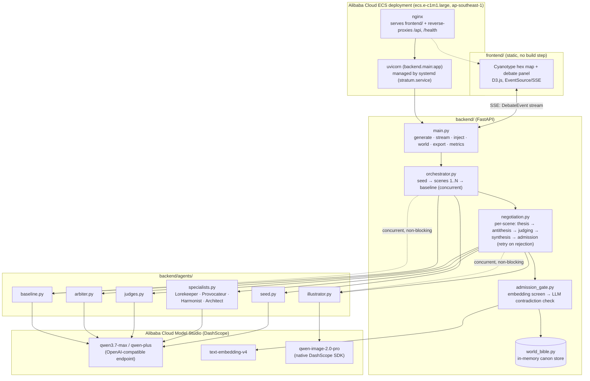

# Stratum

Stratum is a multi-agent system that writes real, playable Twine stories
through adversarial negotiation: four specialist agents with genuinely
conflicting creative mandates propose, critique, and argue every scene
into existence before an Arbiter synthesizes it and a verified admission
gate checks it against everything already agreed. The output compiles to
valid Twee 3 notation, playable in the real Twine desktop app. Every
admitted scene is also illustrated automatically in a fixed cyanotype
style, and a human can inject a constraint mid-run that's admitted into
canon immediately and shapes every scene negotiated afterward.

**Live demo:** http://47.84.114.89 (Alibaba Cloud ECS, Singapore region)

## Architecture



**Negotiation lifecycle** (`backend/negotiation.py`): each scene runs
thesis (all four specialists propose in parallel) → antithesis (structured
cross-critiques) → judging (four dimension-specific judges score every
proposal in one batched call each) → synthesis (the Arbiter rules,
favoring one proposal and stating what it overruled) → verified admission
(embedding-similarity screen, then an LLM contradiction check against only
the plausibly-related prior entries). A rejected synthesis triggers a
targeted re-negotiation of just the conflicting field, up to 3 attempts,
before the scene is honestly skipped rather than forced through.

**On "efficiency gain":** Stratum makes roughly 13-18 model calls per
scene (four proposals, four critiques, four judge-dimension batches, one
synthesis, plus occasional retries) against exactly one call for the
single-shot baseline — see `/api/metrics`'s `token_usage` figure. The
efficiency gain isn't fewer tokens; it's a favorable quality-per-token
trade a single agent has no mechanism to buy at any price, however many
tokens it's given.

## Setup

1. `.env` should already exist at the repo root with your DashScope and
   Alibaba Cloud credentials (see `.env.example` for the expected shape).
   It's git-ignored — never commit it.
2. Create a virtualenv and install dependencies (Python 3.11+):

   ```bash
   python3 -m venv .venv
   source .venv/bin/activate
   pip install -r requirements.txt
   ```

## Running locally

```bash
uvicorn backend.main:app --reload
```

Then serve the frontend as static files (no build step) from a second
terminal, e.g. `python3 -m http.server 8090` from `frontend/`, and open
`http://localhost:8090/index.html`.

### API

- `GET /health` — liveness check.
- `GET /api/models` — lists models visible to your `DASHSCOPE_API_KEY`.
- `POST /api/generate` — starts a run (`{"premise": str, "scene_count"?: int}`),
  returns `{"run_id": str}` immediately; generation runs in the background.
- `GET /api/stream/{run_id}` — SSE stream of `DebateEvent`s as the
  negotiation unfolds (proposals, critiques, judge scores, synthesis,
  admission results, image-ready, etc). Reconnecting mid-run replays
  everything emitted so far before continuing live.
- `GET /api/world/{run_id}` — the run's current world bible snapshot.
- `POST /api/inject/{run_id}` — inject a human constraint mid-run; it's
  admitted into canon immediately and visible to the next scene.
- `GET /api/export/{run_id}` — compiles the run to a `.twee` file.
- `GET /api/metrics/{run_id}` — contradiction rate, creative-divergence
  score, provenance depth, and token usage, compared against the
  single-shot baseline.
- `POST /api/runs/import` — re-registers a run saved by
  `scripts/save_demo_run.py` (see `demo_recordings/`) so it survives a
  server restart and can be replayed via `/api/stream` (see the demo
  section below).

## Demo

The locked demo run and the assembled `stratum_demo.mp4` live under
`demo_recordings/` (git-ignored — regenerate or re-download separately).
To replay a saved run instead of generating live:

```bash
python scripts/load_demo_run.py demo_recordings/<run-dir> "premise text"
# prints a run_id — open the frontend at:
#   ?run=<run_id>&pace=0.2&slow_from=8&slow_to=60&slow_pace=0.8
```

`pace` paces every event by a fixed delay so a finished run looks like
it's unfolding live; `slow_from`/`slow_to`/`slow_pace` slow down one index
range (e.g. the gate-catch scene) without dragging out the rest; `grace`
keeps the stream open a bit past completion so a live `/api/inject` demo
has time to land. All are recording conveniences only — see
`backend/main.py`'s `_stream_run`.

## Tests

```bash
pytest tests/
```

## Deployment

Deployed on a single Alibaba Cloud ECS instance (`ecs.e-c1m1.large`,
Singapore/`ap-southeast-1`): nginx serves `frontend/` as static files and
reverse-proxies `/api/` and `/health` to a uvicorn process managed by
systemd (`stratum.service`, auto-restarts on failure).

## Further reading

Full architecture rationale, research foundations, hackathon context, and
the demo verification plan live in the planning docs at the repo root:

- `stratum-project-overview.md`
- `stratum-architecture-plan.md`
- `stratum-hackathon-reference.md`
- `stratum-demo-and-verification.md`
- `stratum-demo-premise.md`
