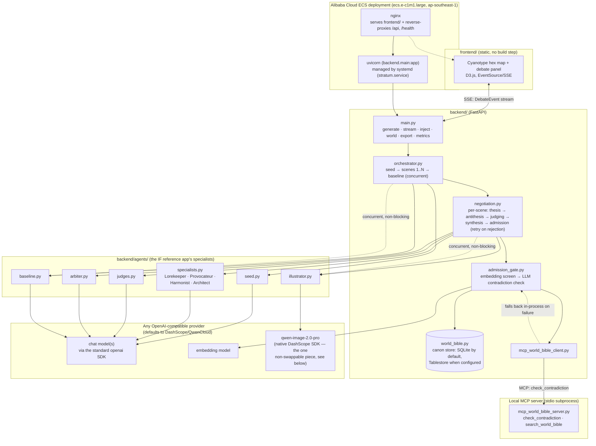

# Stratum

Stratum is a small **framework for multi-agent creative negotiation**:
specialist agents with genuinely conflicting mandates propose, critique, and
argue a piece of content into existence, an Arbiter synthesizes a ruling,
and a verified admission gate checks every ruling against everything
already agreed before it becomes canon. Disagreement is a first-class,
visible part of the output, not noise to be averaged away.

The flagship, fully-working example shipped in this repo is an **interactive
fiction generator**: four specialists (Lorekeeper, Provocateur, Harmonist,
Architect) negotiate a Twine story scene by scene, output compiles to valid
Twee 3 (playable in the real Twine desktop app), and every admitted scene is
illustrated automatically. But the negotiation engine, admission gate, and
metrics harness underneath it don't know anything about interactive
fiction specifically — see [Core engine vs. reference app](#core-engine-vs-reference-app)
if you want to point the same machinery at a different domain.

**Live demo:** http://47.84.114.89 (Alibaba Cloud ECS, Singapore region)

## Who this is for

- **Framework users** — you want the specialist/critique/synthesis/
  admission-gate pattern for your own domain (co-writing, worldbuilding for
  a TTRPG, structured brainstorming, anything where you'd rather see
  agents disagree productively than silently converge). Swap the mandates
  in `backend/agents/prompts.py` and the output schema in
  `backend/schemas.py`; the negotiation loop, judging, admission gate, and
  metrics keep working. See [Extending it for your own domain](#extending-it-for-your-own-domain).
- **Hobbyists** — Twine/interactive-fiction people (itch.io, r/interactivefiction,
  IFComp-adjacent communities) who just want to run the generator as-is, no
  forking required: pick a premise, watch four agents argue a branching story
  into existence, export it to Twine. Self-hosts with no cloud account
  required (see [Quickstart](#quickstart)); the default persistence is a
  local SQLite file.
- **Researchers** — two independent reasons to fork this, not one:
  (1) the quality-vs-compute question — does adversarial multi-agent
  negotiation actually buy anything over a single agent with a matched
  compute budget? `backend/metrics.py` and
  `stratum-baseline-fairness-experiment.md` are the harness and the
  (honestly reported, including where it doesn't fully hold up) result; and
  (2) multi-agent coordination failure modes as a first-class design
  concern, not an afterthought — the admission gate's citation requirements
  and the Harmonist-only `hard_flag` escalation path are a direct mitigation
  for a specific failure mode named in the MAST multi-agent-system
  failure-taxonomy literature (cited in `backend/agents/specialists.py`).
  If you study agent coordination, this is a testbed for swapping in a
  different admission-gate strategy or judge design independent of the
  fiction wrapper (see [Core engine vs. reference app](#core-engine-vs-reference-app)).

## Quickstart

No cloud account needed to try this locally — the only required secret is
one LLM API key, and any OpenAI-compatible provider works.

```bash
git clone <this-repo> && cd stratum
python3 -m venv .venv && source .venv/bin/activate
pip install -r requirements.txt

cp .env.example .env
# edit .env: at minimum, set DASHSCOPE_API_KEY (or LLM_BASE_URL + LLM_API_KEY
# to point at OpenAI, a local vLLM/Ollama server, or any other
# OpenAI-compatible endpoint — see .env.example)

uvicorn backend.main:app --reload
```

Then, from a second terminal, serve the frontend (static files, no build
step):

```bash
cd frontend && python3 -m http.server 8090
```

Open `http://localhost:8090/index.html`, enter a premise, and watch it
negotiate. Runs persist to a local `stratum.db` file (SQLite, created
automatically) so they survive a server restart — see
[Persistence & scalability](#persistence--scalability) for what that
buys you and what its real ceiling is.

## Architecture



**Negotiation lifecycle** (`backend/negotiation.py`): each scene runs
thesis (all four specialists propose in parallel) → antithesis (structured
cross-critiques) → judging (four dimension-specific judges score every
proposal in one batched call each) → synthesis (the Arbiter rules,
favoring one proposal and stating what it overruled) → verified admission
(embedding-similarity screen, then an LLM contradiction check against only
the plausibly-related prior entries). A rejected synthesis triggers a
targeted re-negotiation of just the conflicting field, up to 3 attempts,
before the scene is honestly skipped rather than forced through.

**MCP integration** (`backend/mcp_world_bible_server.py`,
`backend/mcp_world_bible_client.py`): the admission gate's stage-1
embedding screen — ranking existing canon entries by cosine similarity to
a candidate scene, to narrow the field before the expensive LLM
contradiction check — runs through a small local MCP server instead of
being computed directly in-process. The server exposes two tools,
`check_contradiction` (used by the gate: which prior entries is this
candidate plausibly related to) and `search_world_bible` (general-purpose
top-k semantic lookup over canon, for future use by other agents). It's
spawned as a stdio subprocess per call via the official `mcp` Python SDK,
takes already-computed embedding vectors rather than raw text so it needs
no LLM credentials or network access of its own, and every call is
wrapped in a fallback to the identical in-process computation if the MCP
round trip fails for any reason — so a real admission decision genuinely
flows through MCP on the common path, without putting the negotiation
critical path's reliability at the mercy of an extra subprocess.

Two distinct disagreement-resolution mechanisms are doing the work here,
not one: specialist-vs-specialist disagreement within a round is resolved
by the judge panel's scores plus the Arbiter's synthesis (a considered
ruling, not a vote or a coin flip); canon-level conflict — a synthesis
that contradicts something already agreed in an earlier round — is caught
separately by the admission gate and resolved by re-negotiation, not by
argument. The gate exists precisely because the first mechanism alone
can't catch that kind of contradiction: the Arbiter only sees this
round's four proposals, never the full canon. The frontend surfaces both
kinds explicitly (a live disagreement banner plus a per-round timeline
badge for specialist conflicts; a distinct gate banner for canon-level
rejections) rather than only showing the final, agreed-upon result.

**On "efficiency gain":** Stratum makes roughly 13-18 model calls per
scene (four proposals, four critiques, four judge-dimension batches, one
synthesis, plus occasional retries) against exactly one call for the
single-shot baseline — see `/api/metrics`'s `token_usage` figure. The
efficiency gain isn't fewer tokens; the honest claim, replicated across 3
premises (see `stratum-baseline-fairness-experiment.md`), is narrower than
"no single agent can do this at any price": a single agent given a
*matched* compute budget spent on self-critique/revision still closes most
of the gap on creative-divergence score (noisy, premise-dependent, not a
clean win either way). What replicated 3-for-3, and is now a real
quantified metric rather than one person's reading of one baseline's
prose: Stratum's admission gate protected a deliberately contested,
seed-marked fact in every premise, while a compute-matched single agent
confidently resolved it anyway in 2 of 3. The baseline-comparison panel in
the frontend renders this directly: the single-shot baseline's text with
every contradicting paragraph highlighted inline, so the tradeoff is
something you can read, not just a number. Reported as found, not
softened; see that writeup for full methodology, the n=3 replication, and
caveats.

## Core engine vs. reference app

If you're forking this for a different domain, this is the split that
matters:

| Layer | Files | Domain-specific? |
|---|---|---|
| Negotiation engine | `backend/negotiation.py`, `backend/admission_gate.py`, `backend/mcp_world_bible_server.py`/`mcp_world_bible_client.py`, `backend/orchestrator.py`, `backend/runs.py`, `backend/sqlite_store.py`, `backend/cloud_storage.py` | No — thesis/antithesis/judging/synthesis/admission, persistence, and streaming all operate on generic `DebateEvent`/`WorldBibleEntry` records |
| Model access | `backend/models_client.py` | No — provider-agnostic (OpenAI-compatible SDK), model names and endpoint are env-configured |
| Metrics | `backend/metrics.py` | Mostly no — contradiction rate, divergence score, provenance depth, and token usage are all generic; only the baseline-comparison prompt assumes prose output |
| **Specialist mandates & schema** | `backend/agents/prompts.py`, `backend/agents/specialists.py`, `backend/agents/arbiter.py`, `backend/agents/seed.py`, `backend/agents/judges.py`, `backend/schemas.py` | **Yes — this is the IF-specific part.** Roles ("Lorekeeper", "Provocateur"...), their mandates, and `WorldBibleEntry`'s IF-flavored optional fields (`grid_position`, `links`) live here |
| Illustration | `backend/agents/illustrator.py` | Yes — and the one piece that isn't provider-swappable (see below) |
| Export | `backend/twee_export.py` | Yes — compiles canon to Twee 3 specifically |
| UI | `frontend/` | Yes — the hex map, debate timeline, and Twine-flavored controls are all IF presentation |

The generic core doesn't force IF-shaped data through it: `WorldBibleEntry`'s
`grid_position`/`links`/`image_url` fields are all optional, and nothing in
`negotiation.py`, `admission_gate.py`, or `metrics.py` reads them.

## Extending it for your own domain

1. **Rewrite the mandates.** Every specialist's system prompt lives in
   `backend/agents/prompts.py` as one string constant per role
   (`LOREKEEPER_PROMPT`, `PROVOCATEUR_PROMPT`, ...). Nothing else needs to
   change to give your agents new personalities/goals for a new domain —
   the negotiation loop just calls whichever roles exist.
2. **Adjust the output schema, if needed.** `backend/schemas.py`'s
   `WorldBibleEntry` is deliberately generic (`id`, `summary`, `full_text`,
   `status`, `provenance_*`, plus optional IF fields); add or drop optional
   fields for your domain rather than replacing the model.
3. **Point at a different LLM provider, if you want to.** Set
   `LLM_BASE_URL`/`LLM_API_KEY`/`LLM_MODEL_<ROLE>` env vars (see
   `.env.example`) — everything except scene illustration goes through the
   standard `openai` SDK. Illustration (`backend/agents/illustrator.py`)
   uses DashScope's native image SDK because `qwen-image` isn't exposed on
   the OpenAI-compatible endpoint; swapping providers there means either
   pointing it at your provider's image API or leaving it as a no-op (a
   failed/skipped illustration is already a handled, non-fatal outcome).
4. **Swap persistence, if you outgrow SQLite.** `backend/world_bible.py`'s
   `WorldBible` base class has exactly four methods (`add`, `get`, `list`,
   `update`); `SQLiteWorldBible` (default) and `TablestoreWorldBible`
   (Alibaba Cloud) both implement it identically. A Postgres-backed
   implementation is the same shape.

## Persistence & scalability

Runs (the full event log, world-bible canon, and token/status metadata)
persist to a local SQLite file (`STRATUM_DB_PATH`, default `./stratum.db`)
by default — `backend/sqlite_store.py`. This is what makes the difference
between "a demo that only works in one terminal session" and something
you can actually leave running:

- **Restarts don't lose data.** A run is durably written as it happens;
  `backend.runs.get_run()` transparently reloads from SQLite on a cache
  miss (e.g. after a restart).
- **More than one backend process can serve the same runs.** Point
  multiple stateless `uvicorn` processes/replicas at the same `stratum.db`
  file and any of them can serve `/api/world`, `/api/export`,
  `/api/metrics` — and even `/api/stream` *live*, for a run a different
  replica is actively generating, via a polling refresh
  (`Run.refresh_events_from_store`, checked every ~100ms per open stream).
- **The honest ceiling:** this is SQLite in WAL mode, which handles
  concurrent readers plus one active writer per file well at this
  project's real scale (a handful of concurrent negotiations), not
  distributed writes across machines. If that ceiling is actually hit, the
  upgrade path is swapping in a Postgres- or Tablestore-backed
  `WorldBible`/run store — both already conform to the same four-method
  interface, so it's a config change to `backend/cloud_storage.py`'s
  factory, not a rewrite.

**Multi-tenancy:** there's no user/auth model — a run is just a random
12-character ID, and anyone who has (or guesses) a run's URL can view or
export it. That's an intentional, honest fit for "you're self-hosting
this for yourself or a small trusted group," not a public multi-tenant
SaaS. Adding real per-user auth and access control would sit entirely in
`backend/main.py`'s route handlers (a decorator/dependency checking
run ownership) — it hasn't been needed for the flagship use case, so it
isn't built speculatively.

## Setup

1. Copy `.env.example` to `.env` and fill in at least one LLM credential
   (`DASHSCOPE_API_KEY`, or `LLM_BASE_URL`+`LLM_API_KEY` for another
   provider). Alibaba Cloud credentials are optional — without them, runs
   persist to local SQLite and story exports stay local instead of
   uploading to OSS. `.env` is git-ignored — never commit it.
2. Create a virtualenv and install dependencies (Python 3.11+):

   ```bash
   python3 -m venv .venv
   source .venv/bin/activate
   pip install -r requirements.txt
   ```

## Running locally

```bash
uvicorn backend.main:app --reload
```

Then serve the frontend as static files (no build step) from a second
terminal, e.g. `python3 -m http.server 8090` from `frontend/`, and open
`http://localhost:8090/index.html`.

### API

- `GET /health` — liveness check.
- `GET /api/models` — lists models visible to your configured LLM API key.
- `POST /api/generate` — starts a run (`{"premise": str, "scene_count"?: int}`),
  returns `{"run_id": str}` immediately; generation runs in the background.
- `GET /api/stream/{run_id}` — SSE stream of `DebateEvent`s as the
  negotiation unfolds (proposals, critiques, judge scores, synthesis,
  admission results, image-ready, etc). Reconnecting mid-run replays
  everything emitted so far before continuing live.
- `GET /api/world/{run_id}` — the run's current world bible snapshot.
- `POST /api/inject/{run_id}` — inject a human constraint mid-run; it's
  admitted into canon immediately and visible to the next scene.
- `GET /api/export/{run_id}` — compiles the run to a `.twee` file.
- `GET /api/metrics/{run_id}` — contradiction rate, creative-divergence
  score, provenance depth, and token usage, compared against the
  single-shot baseline, plus per-paragraph contradiction evidence.
- `POST /api/runs/import` — re-registers a run saved by
  `scripts/save_demo_run.py` (see `demo_recordings/`) for replay via
  `/api/stream`; largely superseded now that runs persist to SQLite by
  default, still useful for importing a run captured on a different
  machine/database.

## Demo

The locked demo run and the assembled `stratum_demo.mp4` live under
`demo_recordings/` (git-ignored — regenerate or re-download separately).
To replay a saved run instead of generating live:

```bash
python scripts/load_demo_run.py demo_recordings/<run-dir> "premise text"
# prints a run_id — open the frontend at:
#   ?run=<run_id>&pace=0.2&slow_from=8&slow_to=60&slow_pace=0.8
```

`pace` paces every event by a fixed delay so a finished run looks like
it's unfolding live; `slow_from`/`slow_to`/`slow_pace` slow down one index
range (e.g. the gate-catch scene) without dragging out the rest; `grace`
keeps the stream open a bit past completion so a live `/api/inject` demo
has time to land. All are recording conveniences only — see
`backend/main.py`'s `_stream_run`.

## Tests

```bash
pytest tests/
```

Runs with no external services or API keys required — every LLM/MCP/cloud
call in the suite is mocked or exercised against a fake client (see e.g.
`tests/test_cloud_storage.py`, `tests/test_sqlite_store.py`). CI
(`.github/workflows/test.yml`) runs the same suite on every push/PR.

A Playwright smoke test also covers the frontend (page loads, core controls
are present, no console errors, and an axe-core scan finds no critical/
serious accessibility violations). Requires the frontend dev server running
on `:8090` (see "Running locally"):

```bash
npm install && npx playwright install chromium  # one-time setup
npx playwright test
```

## Deployment

Deployed on a single Alibaba Cloud ECS instance (`ecs.e-c1m1.large`,
Singapore/`ap-southeast-1`): nginx serves `frontend/` as static files and
reverse-proxies `/api/` and `/health` to a uvicorn process managed by
systemd (`stratum.service`, auto-restarts on failure). This is one
deployment choice, not a requirement — see [Quickstart](#quickstart) for
running it anywhere with no cloud account at all.

## Hackathon submission evidence

This project started as a submission to an Alibaba Cloud/QwenCloud
hackathon; this section is the evidence trail for that, kept for the
record.

- Live demo URL: http://47.84.114.89
- Architecture diagram and system explanation: this README's Architecture
  section.
- Qwen/DashScope integration: `backend/models_client.py` for
  OpenAI-compatible chat, JSON, embeddings, and token accounting (default
  provider — swappable, see Extending it for your own domain);
  `backend/agents/illustrator.py` for native DashScope qwen-image calls.
- MCP evidence: `backend/mcp_world_bible_server.py`,
  `backend/mcp_world_bible_client.py`, and
  `tests/test_mcp_admission_gate.py`.
- Demo replay path: `scripts/load_demo_run.py` with saved artifacts under
  `demo_recordings/` when available locally.
- Verification: `.venv/bin/python -m pytest tests/ -q`; frontend smoke via
  `npx playwright test` when frontend changes are in scope.
- ECS deployment evidence: this README's Deployment section and the live
  URL above.
- **Alibaba Cloud services/APIs evidence (distinct from QwenCloud/DashScope
  above): `backend/cloud_storage.py`.** Real OSS usage — exporting a run's
  `.twee` story (`GET /api/export/{run_id}`) uploads it to the real
  `stratum-hackathon-assets` OSS bucket and returns a signed URL via the
  `X-OSS-Url` response header; live-verified end-to-end, including from the
  ECS host itself (upload → signed URL → `curl` fetch → HTTP 200 with the
  real content back). Real Tablestore usage — `TablestoreWorldBible` is a
  drop-in, unit-tested (`tests/test_cloud_storage.py`) replacement for the
  in-memory `WorldBible`, wired in via `backend/cloud_storage.py`'s
  `make_world_bible()` factory (SQLite is the default/fallback tier ahead
  of it now — see Persistence & scalability); confirmed live against the
  real, provisioned `stratum-world` instance via a direct read/write check
  (see `stratum-critical-review-checklist.md`'s P0-1 row) — it had
  previously been rejecting all calls with `OTSAuthFailed: The user is
  disabled.`, a console-side instance toggle the account owner has since
  fixed.
- Demo video/artifact note: assembled video and locked replay artifacts are
  expected under git-ignored `demo_recordings/` or attached separately for
  judging.
- Efficiency-gain fairness check: `stratum-baseline-fairness-experiment.md`
  — the naive single-shot baseline above is the weakest possible
  comparison; this document tests against an equal-compute-budget single
  agent instead and reports what was actually found, including where it
  weakens the strong version of the pitch.

## Further reading

Full architecture rationale, research foundations, hackathon context, and
the demo verification plan live in the planning docs at the repo root:

- `stratum-project-overview.md`
- `stratum-architecture-plan.md`
- `stratum-hackathon-reference.md`
- `stratum-demo-and-verification.md`
- `stratum-demo-premise.md`
- `stratum-baseline-fairness-experiment.md` — the equal-compute-budget
  baseline experiment referenced above: real methodology, real numbers,
  honest interpretation.
- `stratum-audit-fix-plan.md` — the live tracker for every issue raised by
  an external frontend/demo-readiness critique and a technical backend/AI
  audit, and how each was actually fixed.
- `stratum-critical-review-checklist.md` — a second, later review round
  (map quality, disagreement-visibility UX, the efficiency-gain claim,
  scalability, and OSS/forkability), and the live tracker for how each was
  addressed — including the discussion this README's Persistence, Core
  engine, and Extending sections came out of.
